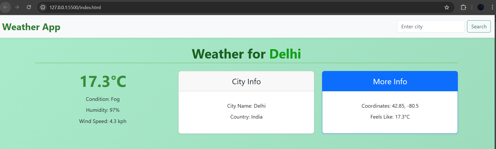
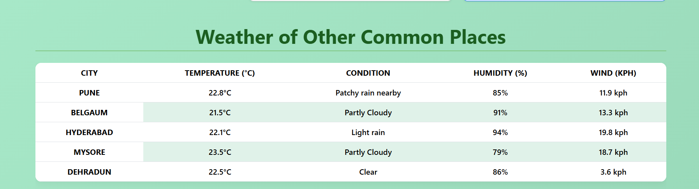

# 🌦️ Weather App

A responsive **Weather App** built using HTML, CSS, JavaScript, and Bootstrap.  
It fetches real-time weather data from the **WeatherAPI (via RapidAPI)** and displays it for user-searched cities as well as predefined common cities.

---

## 🚀 Features
- 🔍 Search weather by **city name**
- 🌡️ Displays **temperature, humidity, wind speed, and condition**
- 📌 Shows **city info (name, country, coordinates)**
- 📋 Includes **"Common Cities" weather table** (Pune, Belgaum, Hyderabad, Mysore, Dehradun)
- 📱 Fully **responsive UI** for desktop & mobile

---

## 🛠️ Tech Stack
- **HTML5**
- **CSS3**
- **JavaScript (ES6+)**
- **Bootstrap 5**
- **WeatherAPI via RapidAPI**

---

## 📸 Screenshots

### 🌆 Main City Weather


### 🏙️ Common Cities Table


---

## ▶️ How to Run
1. Clone the repo:
   ```bash
   git clone https://github.com/nandinipatwa099/WD_1_WeatherApp_ARITHMATRIX.git
   cd WD_1_WeatherApp_ARITHMATRIX
